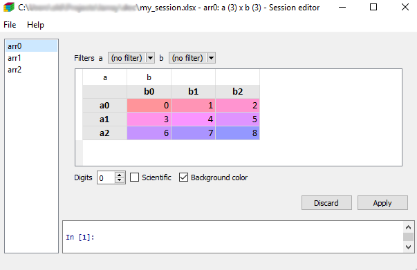
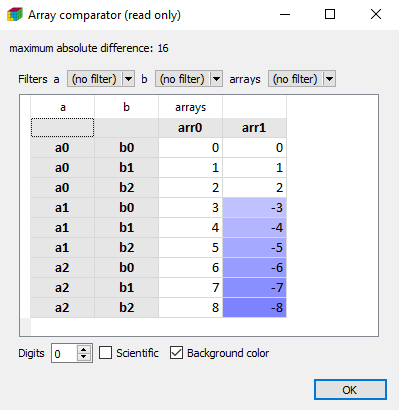
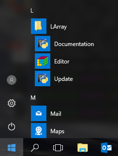
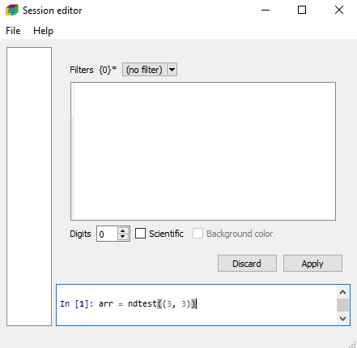

.. currentmodule:: larray

Getting Started
===============

To use the LArray library, the first thing to do is to import it

.. ipython:: python

    from larray import *

Create an array
---------------

Working with the LArray library mainly consists of manipulating :ref:`LArray <api-larray>` data structures.
They represent N-dimensional labelled arrays and are composed of data (numpy ndarray), :ref:`axes <api-axis>`
and optionally a title. An axis contains a list of labels and may have a name (if not given, the axis is anonymous).

You can create an array from scratch by supplying data, axes and optionally a title:

.. ipython:: python

    # define data
    data = [[20, 22],
            [33, 31],
            [79, 81],
            [28, 34]]

    # define axes
    age_category = Axis(["0-9", "10-17", "18-66", "67+"], "age_category")
    sex = Axis(["M", "F"], "sex")

    # create LArray object
    arr = LArray(data, [age_category, sex], "population by age category and sex")
    arr

.. note::

   LArray offers two syntaxes to build axes and make selections and aggregations.
   The first one is more Pythonic (uses Python structures) and allows to use any
   character in labels. The second one consists of using strings that are parsed.
   It is shorter to type. For example, you could create the *age_category* axis
   above as follows::

       age_category = Axis("age_category=0-9,10-17,18-66,67+")

   The drawback of the string syntax is that some characters such as `, ; = : .. [ ] >>`
   have a special meaning and cannot be used in labels.
   Strings containing only integers are interpreted as such.

   In this getting started section we will use the first, more verbose, syntax which
   works in all cases and provide the equivalent using the shorter syntax in comments.
   More examples can be found in the :ref:`tutorial <start_tutorial>` and the
   :ref:`API reference <start_api>` section.

Here are the key properties for an array:

.. ipython:: python

    # array summary : dimensions + description of axes
    arr.info

    # number of dimensions
    arr.ndim

    # array dimensions
    arr.shape

    # number of elements
    arr.size

    # size in memory
    arr.memory_used

    # type of the data of the array
    arr.dtype

Arrays can be generated through dedicated functions:

* :py:func:`zeros` : fills an array with 0
* :py:func:`ones` : fills an array with 1
* :py:func:`full` : fills an array with a given
* :py:func:`eye` : identity matrix
* :py:func:`ndrange` : fills an array with increasing numbers (mostly for testing)
* :py:func:`ndtest` : same as ndrange but with axes generated automatically (for testing)
* :py:func:`sequence` : creates an array by sequentially applying modifications to the array along axis.

.. ipython:: python

   zeros([age_category, sex])

   ndtest((3, 3))

Save/Load an array
------------------

The LArray library offers many I/O functions to read and write arrays in various formats
(CSV, Excel, HDF5, pickle). For example, to save an array in a CSV file, call the method
:py:meth:`~LArray.to_csv`:

.. ipython:: python

    arr_3D = ndtest((2, 2, 2))
    arr_3D

    arr_3D.to_csv('arr_3D.csv')

Content of 'arr_3D.csv' file is ::

  a,b\c,c0,c1
  a0,b0,0,1
  a0,b1,2,3
  a1,b0,4,5
  a1,b1,6,7

.. note::
   In CSV or Excel files, the last dimension is horizontal and the names of the
   two last dimensions are separated by a \\.

To load a saved array, call the function :py:meth:`read_csv`:

.. ipython:: python

    arr_3D = read_csv('arr_3D.csv')
    arr_3D

Other input/output functions are described in the :ref:`corresponding section <api-IO>`
of the API documentation.

Indexing
--------

To select an element or a subset of an array, use brackets [ ].
Let’s start by selecting a single element:

.. ipython:: python

    arr = ndtest((4, 4))
    arr

    arr['a0', 'b1']

    # labels can be given in arbitrary order
    arr['b1', 'a0']

Let's continue with subsets:

.. ipython:: python

    # select subset along one axis
    arr['a0']

    arr['b0']

    # labels associated with the same axis must be given as a list
    # equivalent to: arr['a0', 'b1,b3']
    arr['a0', ['b1', 'b3']]

.. warning::

    Selecting by labels as above only works as long as there is no ambiguity.
    When several axes have common labels and you do not specify explicitly
    on which axis to work, it fails with an error
    (ValueError: ... is ambiguous (valid in a, b)).
    Specifying the axis can be done using the special notation ``x.axis_name``.
    The axis name must not contain whitespaces and special characters.

.. ipython:: python

    # equivalent to: arr2 = ndrange("a=label0,label1;b=label1,label2")
    arr2 = ndrange([Axis(["label0", "label1"], "a"), Axis(["label1", "label2"], "b")])
    arr2

    # equivalent to: arr2["label0", "b[label1]"]
    arr2["label0", x.b["label1"]]

You can also define slices (defined by 'start:stop' or 'start:stop:step').
A slice will select all labels between `start` and `stop` (stop included).
All arguments of a slice are optional.
When not given, start is the first label of an axis, stop the last one.

.. ipython:: python

    # "b1":"b3" is a shortcut for ["b1", "b2", "b3"]
    # equivalent to: arr["a0,a2", "b1:b3"]
    arr[["a0", "a2"], "b1":"b3"]

    # :"a2" will select all labels between the first one and "a2"
    # "b1": will select all labels between "b1" and the last one
    # equivalent to: arr[":a2", "b1:"]
    arr[:"a2", "b1":]

Aggregation
-----------

The LArray library includes many aggregations methods.
For example, to calculate the sum along an axis, write:

.. ipython:: python

    arr_3D

    # equivalent to: arr_3D.sum("a")
    arr_3D.sum(x.a)

To aggregate along all axes except one, you simply have to append `_by`
to the aggregation method you want to use:

.. ipython:: python

    # equivalent to: arr_3D.sum_by("a")
    arr_3D.sum_by(x.a)

See :ref:`here <la_agg>` to get the list of all available aggregation methods.

Groups
------

A :ref:`Group <api-group>` represents a subset of labels or positions of an axis:

.. ipython:: python

    arr

    even = x.a["a0", "a2"]
    even

    odd = x.a["a1", "a3"]
    odd

They can be used in selections:

.. ipython:: python

    arr[even]

    arr[odd]

or aggregations:

.. ipython:: python

    arr.sum((even, odd))

In the case of aggregations, it is often useful to attach them a name
using the ``>>`` operator:

.. ipython:: python

    # equivalent to: arr.sum("a0,a2 >> even; a1,a3 >> odd")
    arr.sum((even >> "even", odd >> "odd"))

Group arrays in Session
-----------------------

Arrays may be grouped in :ref:`Session <api-session>` objects.
A session is an ordered dict-like container of LArray objects with special I/O methods.
To create a session, you need to pass a list of pairs (array_name, array):

.. ipython:: python

    arr0 = ndtest((3, 3))
    arr1 = ndtest((2, 4))
    arr2 = ndtest((4, 2))

    arrays = [("arr0", arr0), ("arr1", arr1), ("arr2", arr2)]
    ses = Session(arrays)

    # displays names of arrays contained in the session
    ses.names
    # get an array
    ses["arr0"]
    # add/modify an array
    ses["arr3"] = ndtest((2, 2, 2))

.. warning::

    You can also pass a dictionary to the Session's constructor but since elements of a dict object are
    not ordered by default, you may lose the order. If you are using python 3.6 or later, using keyword
    arguments is a nice alternative which keeps ordering. For example, the session above can be defined
    using: `ses = Session(arr0=arr0, arr1=arr1, arr2=arr2)`.

One of the main interests of using sessions is to save and load many arrays at once:

.. ipython:: python

    ses.save("my_session.h5")
    ses = Session("my_session.h5")

Graphical User Interface
------------------------

The LArray project provides an optional package called :ref:`larray-editor <start-dependencies-gui>`
allowing users to explore and edit arrays using a graphical interface.
This package is automatically installed with **larrayenv**.

To explore the content of arrays in read-only mode, import ``larray-editor`` and call :py:func:`view`

.. ipython:: python
    :verbatim:

    from larray_editor import *

    # shows the arrays of a given session in a graphical user interface
    view(ses)

    # the session may be directly loaded from a file
    view("my_session.h5")

    # creates a session with all existing arrays from the current namespace
    # and shows its content
    view()

To open the user interface in edit mode, call :py:func:`edit` instead.

Once open, you can save and load any session using the `File` menu.

Finally, you can also visually compare two arrays or sessions using the :py:func:`compare` function.

.. ipython:: python
   :verbatim:

    arr0 = ndtest((3, 3))
    arr1 = ndtest((3, 3))
    arr1[["a1", "a2"]] = -arr1[["a1", "a2"]]
    compare(arr0, arr1)

In case of two arrays, they must have compatible axes.

For Windows Users
^^^^^^^^^^^^^^^^^

Installing the ``larray-editor`` package on Windows will create a ``LArray`` menu in the
Windows Start Menu. This menu contains:

  * a shortcut to open the documentation of the last stable version of the library
  * a shortcut to open the graphical interface in edit mode.
  * a shortcut to update `larrayenv`.

Once the graphical interface is open, all LArray objects and functions are directly accessible.
No need to start by `from larray import *`.

Compatibility with pandas
-------------------------

To convert a LArray object into a pandas DataFrame, the method :py:meth:`~LArray.to_frame` can be used:

.. ipython:: python

    df = arr.to_frame()
    df

Inversely, to convert a DataFrame into a LArray object, use the function :py:func:`aslarray`:

.. ipython:: python

    arr = aslarray(df)
    arr