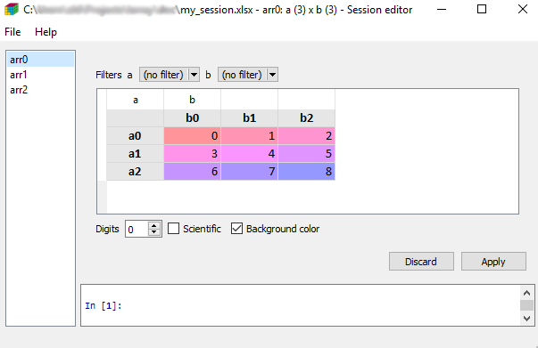

.. image:: _static/larray-logo.png
    :align: center

|

N-dimensional labelled arrays
=============================

.. include:: ../../README.rst
   :start-after: start-intro:
   :end-before: start-install:

.. include:: ../../README.rst
   :start-after: start-documentation:
   :end-before: end-readme-file

.. raw:: html

   

   You can subscribe to the announce mailing list by entering your email address here
   (if you are connected to your Google account but you want to subscribe using another address,
    please log out first):
   

   <form action="https://groups.google.com/group/larray-announce/boxsubscribe">
   <input type="text" name="email:" id="subscribe-email"/>
   <input type="submit" name="sub" value="Subscribe">
   </form>

Contents
========

.. toctree::
   :maxdepth: 2

   install
   getting_started
   tutorial
   api

Indices and tables
==================

* :ref:`genindex`
* :ref:`modindex`
* :ref:`search`

Appendix
========

.. toctree::
   :maxdepth: 1

   changes
   contribute
