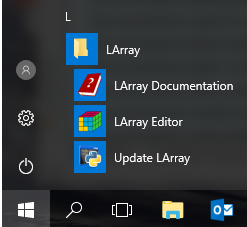

.. include:: ../../README.rst
   :start-after: start-install:
   :end-before: start-documentation:

.. _start-update:

Update
------

If larray has been installed using conda, update is done via ::

    conda update larray

Be careful if you have installed optional dependencies.
In that case, you may have to update some of them.

If larray has been installed using conda via larrayenv, you simply must do ::

    conda update larrayenv

For Windows users who have larrayenv (>= 0.25) installed, simply click on the
``Update LArray`` link in the the Windows Start Menu > LArray.

